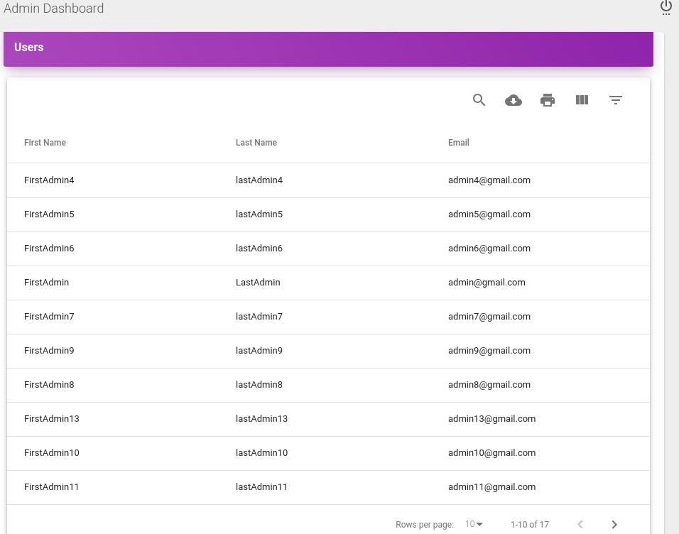

# [Plan Application](https://plans-admin.herokuapp.com)
It is an example application, which has two parts 
 * [Plan API](https://plans-api.herokuapp.com): A backend API application developed with Golang. 
 * [Plan Admin Dashboard](https://plans-admin.herokuapp.com): A Frontend application developed with ReactJs and Redux.

Test user email/password  admin@gmail.com/123456


## Plan Admin Dashboard Table of Contents
* [Dashboard](#dashboard)
* [User List](#user-list)
* [Plan List](#plan-list)
* [Plan Detail](#plan-detail)
* [Plan Dialog](#plan-dialog)
* [Login](#login)
* [Register](#register)
* [File Structure](#file-structure)


## Dashboard 
Each data element's data coming from the seperate API calls. 


## User List 
The user table grid is based on mui-datatables https://www.material-ui-datatables.com/


## Plan List 
The Plan editable grid is based on DevExtreme React Grid https://devexpress.github.io/devextreme-reactive/react/grid/demos/featured/data-editing/


## Plan Detail 


## Plan Dialog 


## Login 


## Register


## File Structure  

```
├── bower.json
├── documentation
│   ├── assets
│   │   ├── css
│   │   │   ├── bootstrap.min.css
│   │   │   ├── demo-documentation.css
│   │   │   └── material-dashboard.css
│   │   ├── img
│   │   │   ├── apple-icon.png
│   │   │   ├── cover.jpeg
│   │   │   ├── faces
│   │   │   │   └── marc.jpg
│   │   │   ├── favicon.png
│   │   │   ├── mask.png
│   │   │   ├── new_logo.png
│   │   │   ├── reactlogo.png
│   │   │   ├── sidebar-1.jpg
│   │   │   ├── sidebar-2.jpg
│   │   │   ├── sidebar-3.jpg
│   │   │   ├── sidebar-4.jpg
│   │   │   └── tim_80x80.png
│   │   └── js
│   │       ├── bootstrap.min.js
│   │       └── jquery-3.2.1.min.js
│   └── tutorial-components.html
├── ISSUE_TEMPLATE.md
├── LICENSE
├── LICENSE.md
├── package.json
├── package-lock.json
├── public
│   ├── apple-icon.png
│   ├── favicon2.ico
│   ├── favicon.ico
│   ├── index.html
│   └── manifest.json
├── README.md
└── src
    ├── actions
    │   ├── DashboardActions.js
    │   ├── DefaultActions.js
    │   ├── LoginActions.js
    │   ├── PlanMessagesActions.js
    │   ├── PlansActions.js
    │   ├── RegisterActions.js
    │   └── UsersListActions.js
    ├── Api
    │   ├── api.js
    │   └── common.js
    ├── assets
    │   ├── css
    │   │   └── material-dashboard-react.css
    │   ├── github
    │   │   ├── angular.png
    │   │   ├── chrome.png
    │   │   ├── dashboard.jpg
    │   │   ├── edge.png
    │   │   ├── firefox.png
    │   │   ├── html.png
    │   │   ├── map.jpg
    │   │   ├── md-react.gif
    │   │   ├── notifications.jpg
    │   │   ├── opera.png
    │   │   ├── opt_md_angular_thumbnail.jpg
    │   │   ├── opt_mdr_thumbnail.jpg
    │   │   ├── opt_md_thumbnail.jpg
    │   │   ├── opt_md_vue_thumbnail.jpg
    │   │   ├── react.svg
    │   │   ├── safari.png
    │   │   ├── tables.jpg
    │   │   ├── userprofile.jpg
    │   │   └── vuejs.png
    │   ├── img
    │   │   ├── apple-icon.png
    │   │   ├── dashboard.png
    │   │   ├── faces
    │   │   │   └── marc.jpg
    │   │   ├── favicon.png
    │   │   ├── login.png
    │   │   ├── logo
    │   │   │   ├── molecule-114-192917.png
    │   │   │   ├── molecule-120-192917.png
    │   │   │   ├── molecule-144-192917.png
    │   │   │   ├── molecule-152-192917.png
    │   │   │   ├── molecule-16-192917.png
    │   │   │   ├── molecule-24-192917.png
    │   │   │   ├── molecule-32-192917.png
    │   │   │   ├── molecule-48-192917.png
    │   │   │   ├── molecule-57-192917.png
    │   │   │   ├── molecule-64-192917.png
    │   │   │   └── molecule-72-192917.png
    │   │   ├── planDetail.png
    │   │   ├── planDialog.png
    │   │   ├── planList.png
    │   │   ├── reactlogo.png
    │   │   ├── register.jpeg
    │   │   ├── register.png
    │   │   ├── sidebar-2.jpg
    │   │   └── userList.png
    │   └── jss
    │       ├── material-dashboard-react
    │       │   ├── cardImagesStyles.jsx
    │       │   ├── checkboxAdnRadioStyle.jsx
    │       │   ├── components
    │       │   │   ├── buttonStyle.jsx
    │       │   │   ├── cardAvatarStyle.jsx
    │       │   │   ├── cardBodyStyle.jsx
    │       │   │   ├── cardFooterStyle.jsx
    │       │   │   ├── cardHeaderStyle.jsx
    │       │   │   ├── cardIconStyle.jsx
    │       │   │   ├── cardStyle.jsx
    │       │   │   ├── customInputStyle.jsx
    │       │   │   ├── customTabsStyle.jsx
    │       │   │   ├── footerStyle.jsx
    │       │   │   ├── headerLinksStyle.jsx
    │       │   │   ├── headerStyle.jsx
    │       │   │   ├── sidebarStyle.jsx
    │       │   │   ├── snackbarContentStyle.jsx
    │       │   │   ├── tableStyle.jsx
    │       │   │   ├── tasksStyle.jsx
    │       │   │   └── typographyStyle.jsx
    │       │   ├── dropdownStyle.jsx
    │       │   ├── layouts
    │       │   │   ├── dashboardStyle.jsx
    │       │   │   └── pagesStyle.jsx
    │       │   ├── tooltipStyle.jsx
    │       │   └── views
    │       │       ├── dashboardStyle.jsx
    │       │       ├── iconsStyle.jsx
    │       │       └── loginPageStyle.jsx
    │       └── material-dashboard-react.jsx
    ├── components
    │   ├── Card
    │   │   ├── CardAvatar.jsx
    │   │   ├── CardBody.jsx
    │   │   ├── CardFooter.jsx
    │   │   ├── CardHeader.jsx
    │   │   ├── CardIcon.jsx
    │   │   └── Card.jsx
    │   ├── CustomButtons
    │   │   └── Button.jsx
    │   ├── CustomInput
    │   │   └── CustomInput.jsx
    │   ├── CustomTabs
    │   │   └── CustomTabs.jsx
    │   ├── Footer
    │   │   └── Footer.jsx
    │   ├── Grid
    │   │   ├── GridContainer.jsx
    │   │   └── GridItem.jsx
    │   ├── Header
    │   │   ├── Header.jsx
    │   │   ├── HeaderLinks.jsx
    │   │   └── HeaderPublic.jsx
    │   ├── HOC
    │   │   └── restricted.jsx
    │   ├── RemoteLookupEditCell
    │   │   └── RemoteLookupEditCell.jsx
    │   ├── Sidebar
    │   │   └── Sidebar.jsx
    │   ├── Snackbar
    │   │   ├── SnackbarContent.jsx
    │   │   ├── Snackbar.jsx
    │   │   └── UndefinedErrorSnackbar.jsx
    │   ├── Table
    │   │   └── Table.jsx
    │   ├── Tasks
    │   │   └── Tasks.jsx
    │   └── Typography
    │       ├── Danger.jsx
    │       ├── Info.jsx
    │       ├── Muted.jsx
    │       ├── Primary.jsx
    │       ├── Quote.jsx
    │       ├── Success.jsx
    │       └── Warning.jsx
    ├── constants
    │   ├── Dashboard.js
    │   ├── Default.js
    │   ├── Login.js
    │   ├── Plan.js
    │   ├── PlanMessage.js
    │   ├── Register.js
    │   └── User.js
    ├── demo-data
    │   ├── data.json
    │   ├── generator.js
    │   └── random.js
    ├── index.js
    ├── layouts
    │   ├── AdminDashboard.jsx
    │   ├── Public.jsx
    │   └── UserDashboard.jsx
    ├── reducers
    │   ├── dashboard.js
    │   ├── defaultStates.js
    │   ├── index.js
    │   ├── login.js
    │   ├── plan.js
    │   ├── planMsg.js
    │   ├── register.js
    │   └── user.js
    ├── routes
    │   ├── dashboard.jsx
    │   ├── index.jsx
    │   └── public.jsx
    ├── store
    │   └── configureStore.js
    ├── theme-sources
    │   └── material-ui
    │       └── components
    │           ├── currency-type-provider.jsx
    │           ├── highlighted-cell.jsx
    │           ├── link-cell.jsx
    │           ├── loading.css
    │           ├── loading.jsx
    │           ├── percent-type-provider.jsx
    │           └── progress-bar-cell.jsx
    ├── variables
    │   ├── auth.jsx
    │   ├── charts.jsx
    │   └── general.jsx
    └── views
        ├── Dashboard
        │   └── DashboardComp.jsx
        ├── Dashboard.jsx
        ├── Login
        │   └── LoginComp.jsx
        ├── Login.jsx
        ├── Plan
        │   ├── PlanComp.jsx
        │   └── PlanMsgDialog
        │       └── PlanMsgDialog.jsx
        ├── Plan.jsx
        ├── PlansList
        │   └── PlansListComp.jsx
        ├── PlansList.jsx
        ├── Register
        │   └── RegisterComp.jsx
        ├── Register.jsx
        ├── UserProfile
        │   └── UserProfile.jsx
        ├── UsersList
        │   └── UsersListComp.jsx
        └── UsersList.jsx

```
