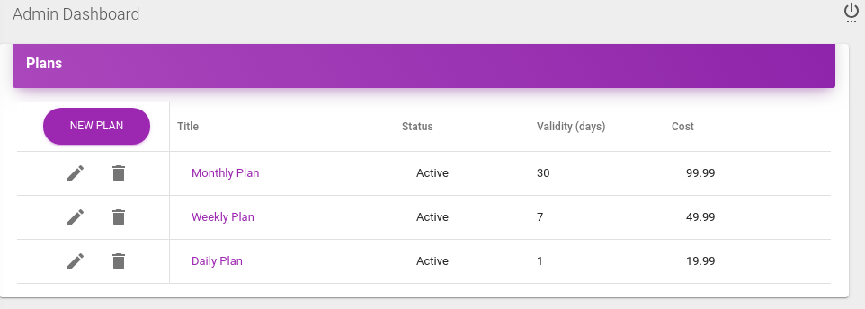

# [Plan Application](https://plans-admin.herokuapp.com)
It is an example application, which has two parts 
 * [Plan API](https://plans-api.herokuapp.com): A backend API application developed with Golang. 
 * [Plan Admin Dashboard](https://plans-admin.herokuapp.com): A Frontend application developed with ReactJs and Redux.

## Plan Admin Dashbord Table of Contents
* [Dashboard](#dashboard)
* [User List](#user-list)
* [Plan List](#plan-list)
* [Plan detail](#plan-detail)
* [Plan dialog](#plan-dialog)
* [File Structure](#file-structure)

## Dashboard 
Each data element's data coming from seperate API calls. 

## User List 
The user table grid is based on mui-datatables https://www.material-ui-datatables.com/

## Plan List 
The Plan editable grid is based on DevExtreme React Grid https://devexpress.github.io/devextreme-reactive/react/grid/demos/featured/data-editing/

## Plan Detail 

## Plan Dialog 

